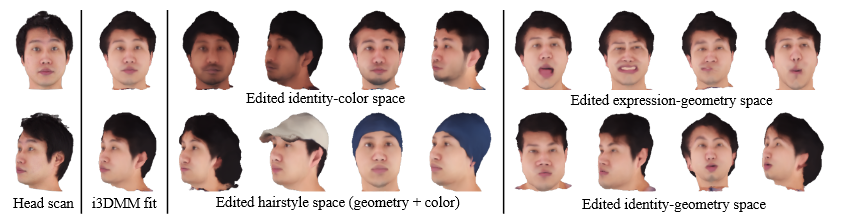

# i3DMM: Deep Implicit 3D Morphable Model of Human Heads  
# CVPR 2021 (Oral)
[Arxiv](https://arxiv.org/abs/2011.14143) | [Poject Page](http://gvv.mpi-inf.mpg.de/projects/i3DMM/)



This project is the official implementation our work, i3DMM. Much of our code is from [DeepSDF's repository](https://github.com/facebookresearch/DeepSDF). We thank Park et al. for making their code publicly available.

The pretrained model is included in this repository.

### Setup
1. To get started, clone this repository into a local directory.
2. Install [Anaconda](https://www.anaconda.com/products/individual#linux), if you don't already have it.
3. Create a conda environment in the path with the following command:
```
conda create -p ./i3dmm_env
```
3. Activate the conda environment from the same folder:
```
conda activate ./i3dmm_env
```
4. Use the following commands to install required packages:
```
conda install pytorch=1.1 cudatoolkit=10.0 -c pytorch
pip install opencv-python trimesh[all] scikit-learn mesh-to-sdf plyfile
```
### Preparing Data
#### Rigid Alignment
We assume that all the input data is rigidly aligned. Therefore, we provide reference 3D landmarks to align your test/training data. Please use centroids.txt file in the model folder to align your data to these landmarks. The landmarks in the file are in the following order:
1. Right eye left corner
2. Right eye right corner
3. Left eye left corner
4. Left eye right corner
5. Nose tip
6. Right lips corner
7. Left lips corner
8. Point on the chin
The following image shows these landmarks. The centroids.txt file consists of 3D landmarks with coordinates x, y, z. Each file consists of 8 lines. Each line consists of the 3 values in 'x y z' order corresponding to the landmarks described above separated by a space.


Please see our paper for more information on rigid alignment.

#### Dataset
We closely follow [ShapeNet Dataset's](https://shapenet.org/) folder structure. Please see the a mesh folder in the dataset for an example.
The dataset is assumed to be as follows:
```
<dataset>/<className>/<Model Name>/models/<Model Name>.obj
<dataset>/<className>/<Model Name>/models/<Model Name>.mtl
<dataset>/<className>/<Model Name>/models/<Model Name>.jpg
<dataset>/<className>/<Model Name>/models/centroids.txt
<dataset>/<className>/<Model Name>/models/centroidsEars.txt
```
The model name should be in a specific structure, xxxxx_eyy where xxxxx are 5 characters which identify an identity and yy are unique numbers to specify different expressions and hairstyles. We follow e01 - e10 for different expressions where e07 is neutral expression. e11-e13 are hairstyles in neutral expression. Rest of the expression identifiers are for test expressions.

The centroids.txt file contains landmarks as described in the alignment step. Additionally, to train the model, one could also have centroidEars.txt file which has the 3D ear landmarks in the following order:
1. Left ear top
2. Left ear left
3. Left ear bottom
4. Left ear right
5. Right ear top
6. Right ear left
7. Right ear bottom
8. Right ear right
These 8 landmarks are as shown in the following image. The file is organized similar to centroids.txt. Please see the a mesh folder in the dataset for an example.

 

Once the dataset is prepared, create the splits as shown in model/headModel/splits/\*.json files. These files are similar to the splits files in DeepSDF.

### Preprocessing

The following commands preprocesses the meshes from the dataset described above and places them in data folder. The command must be run from "model" folder.
To preprocess training data:
```
python preprocessData.py --samples_directory ./data --input_meshes_directory <path to dataset>  -e headModel -s Train
```
To preprocess test data:

```
python preprocessData.py --samples_directory ./data --input_meshes_directory <path to dataset> -e headModel -s Test
```
'headModel' is the folder containing network settings for the 'specs.json'. The *json* file also contains split file and preprocessed data paths. The splits files are in model/headModel/splits/\*.json
These files indicate files that are for testing, training, and reference shape initialisation.

### Training the Model

Once data is preprocessed, one can train the model with the following command.

```
python train_i3DMM.py -e headModel
```
When working with a large dataset, please consider using batch_split option with a power of 2 (2, 4, 8, 16 etc.). The following command is an example.

```
python train_i3DMM.py -e headModel --batch_split 2
```

Additionally, if one considers using landmark supervision or ears constraints for long hair (see paper for details), please export the centroids and ear centroids as a dictionaries with npy files (8 face landmarks: eightCentroids.npy, ear landmarks: gtEarCentroids.npy).

An example entry in the dictionary: ```{"xxxxx_eyy: 8x3 numpy array"}```

### Fitting i3DMM to Preprocessed Data

Please see the preprocessing section for preparing the data. Once the data is ready, please use the following command to fit i3DMM to the data.

To save as image:
```
python fit_i3DMM_to_mesh.py -e headModel -c latest -d data -s <path to splits file> --imNM True
```

To save as a mesh:
```
python fit_i3DMM_to_mesh.py -e headModel -c latest -d data -s <path to splits file> --imNM False
```
Test dataset can be downloaded with this [link](TODO). Please extract and move the 'heads' folder to dataset folder.


### Citation

Please cite our paper if you use any part of this repository.
```
@inproceedings {yenamandra2020i3dmm,
 author = {T Yenamandra and A Tewari and F Bernard and HP Seidel and M Elgharib and D Cremers and C Theobalt},
 title = {i3DMM: Deep Implicit 3D Morphable Model of Human Heads},
 booktitle = {Proceedings of the IEEE / CVF Conference on Computer Vision and Pattern Recognition (CVPR)},
 month = {June},
 year = {2021}
}
```
